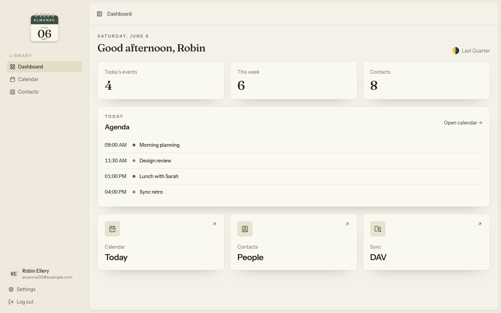
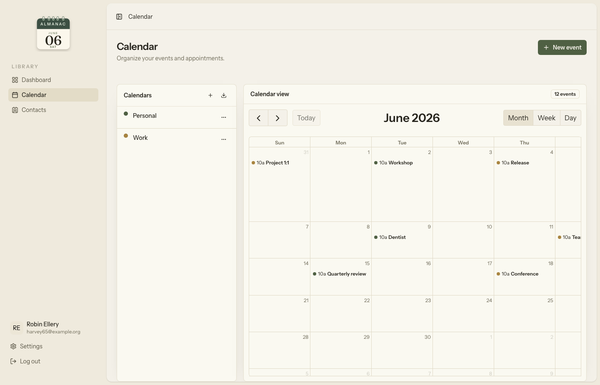
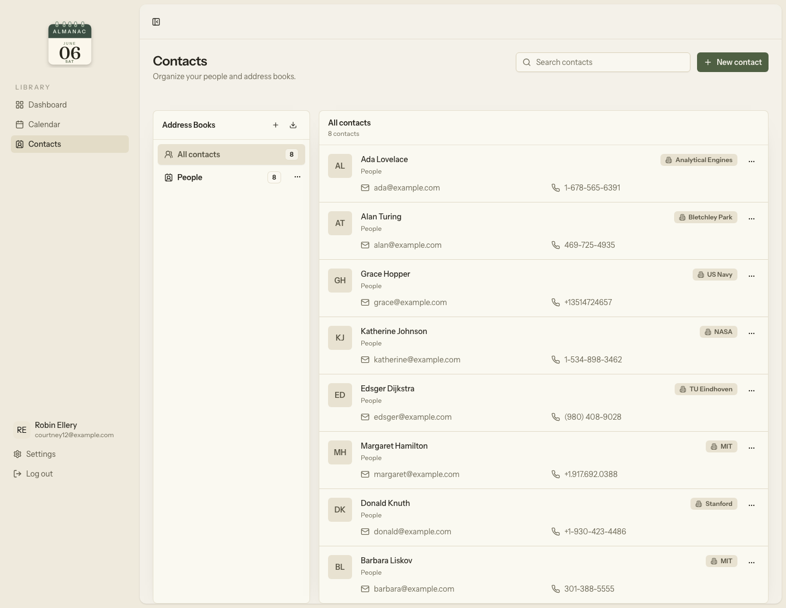
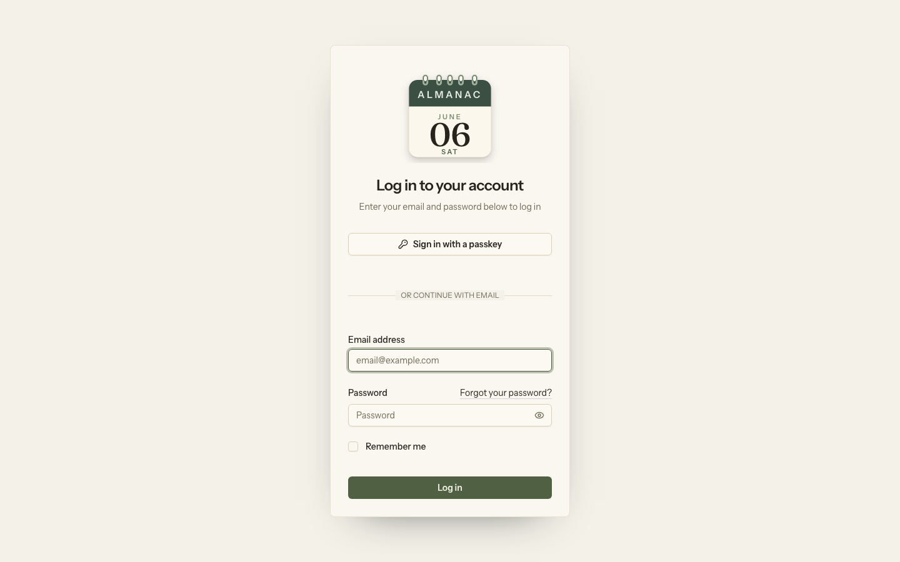
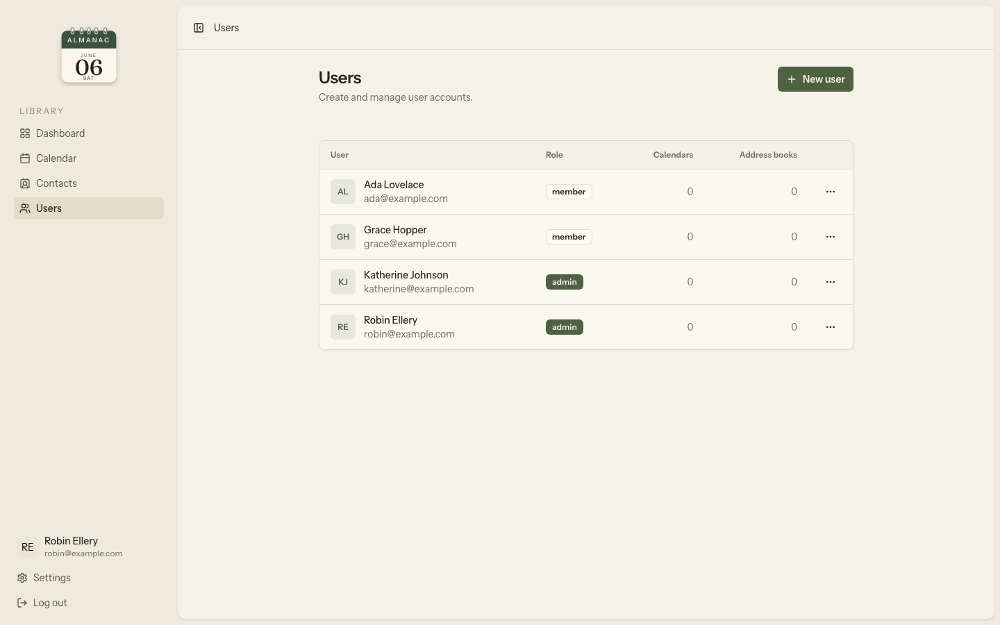
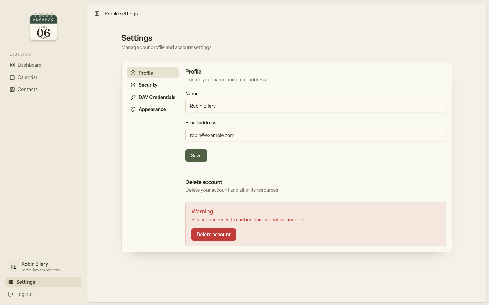

# Almanac

A self-hosted CalDAV/CardDAV calendar and contacts manager built with Laravel, Inertia.js, and React.

## Features

- **Calendar** — CalDAV calendars, event editing, exports, and month, week, and day views powered by FullCalendar
- **Contacts** — CardDAV address books, vCard exports, typed contact fields, phone numbers, email addresses, and postal addresses
- **DAV sync** — connect desktop and mobile calendar/contact clients with per-user DAV credentials
- **Users** — admin-managed users, roles, and permissions
- **Authentication** — password login, passkeys, and two-factor authentication (TOTP)
- **Themes** — light and dark mode

## Built with

Laravel 13 · Inertia.js · React 19 · Tailwind CSS 4 · Laravel Fortify · Laravel Reverb · [bambamboole/laravel-dav](https://github.com/bambamboole/laravel-dav)

## Local setup

Create a new Almanac project:

```bash
composer create-project bambamboole/almanac almanac
cd almanac
npm install
```

Then run the installer:

```bash
php artisan almanac:install
```

Follow the installer prompts for the remaining setup information. It configures the app key, timezone, database connection, migrations, roles, the first admin user, and optional demo data.

For an existing checkout, run `composer install` and `npm install` before the installer.

For local development, serve the application with Laravel Herd and run the development processes:

```bash
composer dev
```

This starts Reverb, Pail, and the Vite development server. Herd serves the actual application.

For local calendar and contacts sync, secure the Herd site so DAV clients can connect over HTTPS:

```bash
herd secure almanac
```

## DAV clients

Create a DAV credential in **Settings -> DAV Credentials**. Use your HTTPS Almanac URL with the `/dav/` path as the server URL:

```text
https://almanac.test/dav/
```

Use the generated DAV username and password for Apple Calendar, Apple Contacts, or another CalDAV/CardDAV client. Most desktop and mobile DAV clients require a trusted HTTPS connection, so the Herd site needs to be secured locally.

## Development commands

```bash
composer ci:check      # frontend checks, Rector, PHPStan, Pint, and Pest
composer fix           # Rector, Pint, oxfmt, oxlint, PHPStan
npm run types:check    # regenerate Wayfinder types and run TypeScript
npm run oxfmt          # format resources/js
npm run lint:check     # run Oxlint
```

## Screenshots

<table>
    <tr>
        <td width="50%" align="center">
            <a href="art/screenshots/dashboard.png">
                
            </a>
            <br>
            <sub>Dashboard</sub>
        </td>
        <td width="50%" align="center">
            <a href="art/screenshots/calendar.png">
                
            </a>
            <br>
            <sub>Calendar</sub>
        </td>
    </tr>
    <tr>
        <td width="50%" align="center">
            <a href="art/screenshots/contacts.png">
                
            </a>
            <br>
            <sub>Contacts</sub>
        </td>
        <td width="50%" align="center">
            <a href="art/screenshots/login.png">
                
            </a>
            <br>
            <sub>Login</sub>
        </td>
    </tr>
    <tr>
        <td width="50%" align="center">
            <a href="art/screenshots/users.png">
                
            </a>
            <br>
            <sub>Users</sub>
        </td>
        <td width="50%" align="center">
            <a href="art/screenshots/settings.png">
                
            </a>
            <br>
            <sub>Settings</sub>
        </td>
    </tr>
</table>
